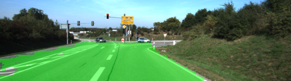
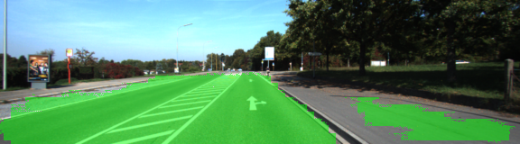

# Semantic Segmentation

## Goal

In this project we use

+ tranfer learning
+ fully convolutional networks and
+ skip layers

to build a well-performing image segmentation model.

## Data

The training data is the [Kitty Dataset](http://www.cvlibs.net/datasets/kitti/eval_road.php). 

## Architecture

The basic architecture is the well-known VGG-16 network. This network, including weights, is loaded. Then the final layer is replaced by a 1x1 convolution. Afterwards, we sequentially add deconvolution layers to upsample the network. Skip connections are added to improve the peroformance. To avoid overfitting, regularization is added.

The loss function is cross-entropy.

## Training and results

The network is trained for 50 epochs and the loss decreases quickly. Actually, we could have stopped after around 25 epochs. In the end, the loss is around 0.02

Here are a few good examples:

And a worse one:

